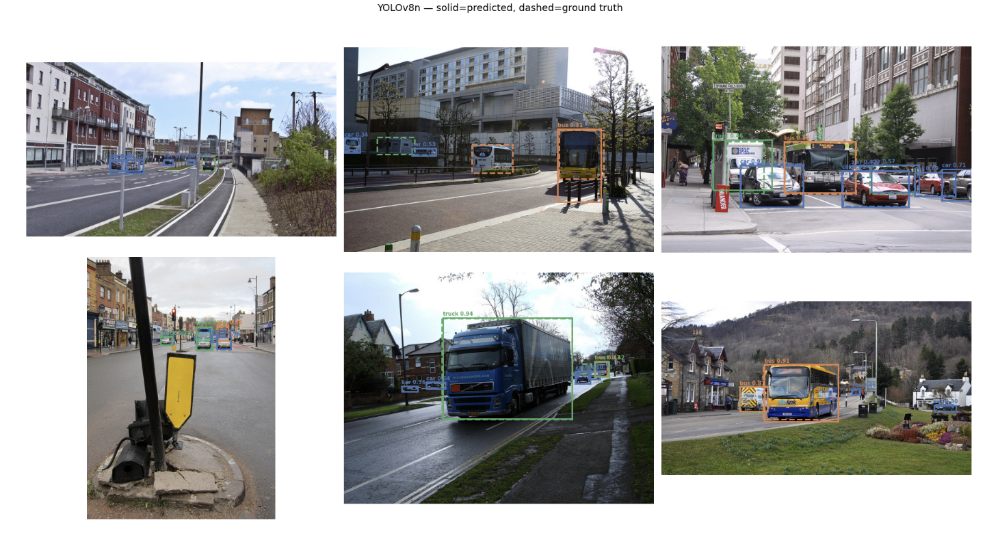
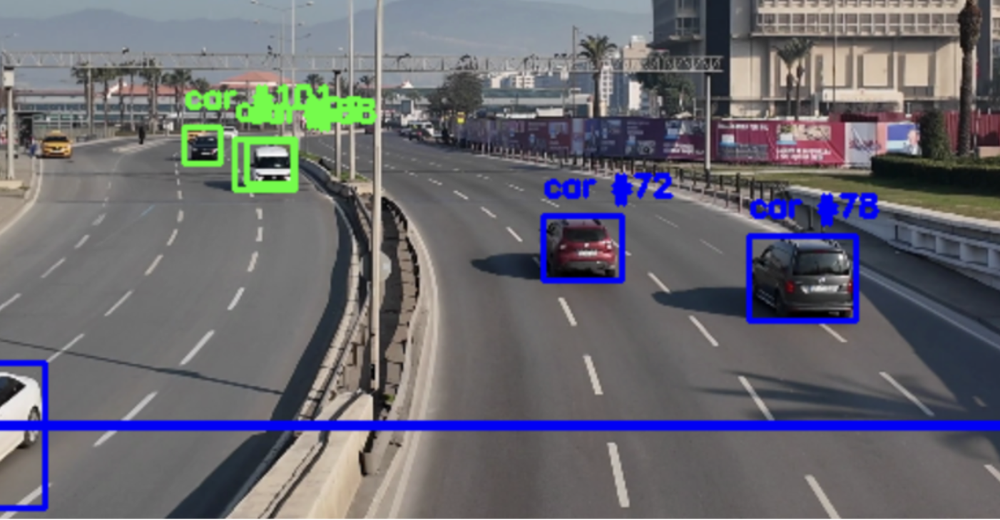
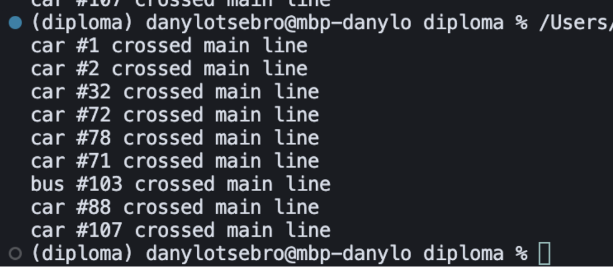

# Система моніторингу транспортного потоку на основі комп'ютерного зору

Дослідження алгоритмів  комп’ютерного зору та глибокого навчання для системи відеоспостереження з розпізнаванням об'єктів та аналізу простору та демонстраційний застосунок розпізнавання транспортного потоку з запису з відеокамери.

## Автор

- **ПІБ:** Цебро Данило Андрійович
- **Група:** ФеС-42
- **Керівник:** Кулик Петро Русланович
- **Дата виконання:** 29.05.2026

## Загальна інформація

- **Тип проєкту:** Демонстраційний застосунок + дослідницькі Jupyter-ноутбуки
- **Мова програмування:** Python 3.10+
- **Фреймворки / Бібліотеки:** Ultralytics (YOLO, RT-DETR), PyTorch, torchvision (Faster R-CNN), OpenCV, Shapely, FiftyOne, pandas, matplotlib, seaborn

## Опис функціоналу

- Детекція транспортних засобів (автомобілі, автобуси, вантажівки) у відеопотоці
- Відстеження об'єктів між кадрами з присвоєнням унікальних ID
- Підрахунок транспортних засобів, що перетнули задану лінію обліку
- Виявлення порушень смуг руху (перетин ліній розмітки)
- Інтерактивне задання ліній обліку та смуг мишею прямо у вікні відео
- Порівняльне оцінювання чотирьох моделей (YOLOv8n, YOLOv11n, RT-DETR-L, Faster R-CNN) за метриками mAP, точності, F1-score та FPS, тощо

## Опис основних класів / файлів

| Файл | Опис |
|------|------|
| `main.py` | Головний застосунок реального часу: читання відео, виклик детектора, відмальовка результатів та обробка подій миші |
| `src/config.py` | Конфігурація: шлях до відео й моделі, розміри кадру, цільові класи, координати ліній та кольори |
| `src/detector.py` | Клас `ObjectDetector` — обгортка над моделлю YOLO з методом `track()` для детекції та відстеження |
| `src/tracker.py` | Клас `TrafficTracker` — облік перетинів лінії та виявлення порушень смуг через геометрію `shapely` |
| `src/utils.py` | Функція `detect_lanes()` — виділення ліній розмітки через HLS-маску та перетворення Хафа |
| `notebooks/` | Jupyter-ноутбуки для дослідження датасету та оцінювання моделей |

## Як запустити проєкт "з нуля"

### Вимоги

- Python 3.10 або новіший + pip
- (Опційно) GPU з підтримкою CUDA для прискорення навчання

### Клонування репозиторію

```bash
git clone https://github.com/DanyloTs/diploma.git
cd diploma
```

### Створення віртуального середовища

**macOS / Linux:**
```bash
python3 -m venv .venv
source .venv/bin/activate
```

**Windows:**
```bash
python -m venv .venv
.venv\Scripts\activate
```

### Встановлення залежностей

```bash
pip install -r requirements.txt
```

> Встановлення може тривати кілька хвилин через розмір PyTorch та Ultralytics.

### Запуск головного застосунку

```bash
python main.py
```

Моделі (`.pt`) завантажуються автоматично при першому запуску.

### Запуск ноутбуків

```bash
jupyter notebook
```

| Ноутбук | Опис |
|---------|------|
| `dataset_exploration.ipynb` | Аналіз датасету COCO 2017 |
| `yolov8_evaluation.ipynb` | Оцінювання моделі YOLOv8n |
| `yolov11_evaluation.ipynb` | Оцінювання моделі YOLOv11n |
| `rtdetr_evaluation.ipynb` | Оцінювання моделі RT-DETR-L |
| `faster_rcnn_evaluation.ipynb` | Оцінювання моделі Faster R-CNN |
| `model_comparison.ipynb` | Порівняння всіх моделей |
| `analytics.ipynb` | Поглиблений аналіз метрик |

## Інструкція для користувача

Після запуску `python main.py` відкривається вікно `Traffic System` з обробкою відео:

1. **Задання лінії обліку (синя):** затисніть **праву** кнопку миші, проведіть лінію та відпустіть.
2. **Задання смуги руху (жовта):** затисніть **ліву** кнопку миші, проведіть лінію та відпустіть. Можна додати кілька смуг.
3. **Лічильники** у верхньому лівому куті показують кількість перетинів (`Crossed`) та порушень (`Violations`).
4. **Кольори рамок:** 🟢 зелений — об'єкт у русі; 🔵 синій — перетнув лінію обліку; 🔴 червоний — порушення смуги.

**Гарячі клавіші:**
- `c` — очистити всі жовті лінії та лічильник порушень
- `q` — вийти із застосунку

## Моделі

Моделі завантажуються автоматично при першому запуску. Файли `.pt` для YOLO-моделей зберігаються у кореневій директорії після першого завантаження.

| Модель | Розмір | FPS | mAP@0.5 |
|--------|--------|-----|---------|
| YOLOv8n | 6.2 MB | 39.9 | 0.476 |
| YOLOv11n | 5.4 MB | 40.7 | 0.500 |
| Faster R-CNN | 159.8 MB | 1.8 | 0.584 |
| RT-DETR-L | 63.4 MB | 2.6 | 0.686 |

## Датасет

Для оцінювання моделей використовується датасет **COCO 2017** (валідаційна вибірка), що завантажується автоматично через бібліотеку `fiftyone` при першому запуску відповідного ноутбука.

## Приклади / скриншоти

| Детекція та відстеження | Кадр з демонстраційного застосунку | Логування 3|
|:---:|:---:|:---:|
|  |  |  |

## Проблеми і рішення

- **Низький FPS важких моделей (RT-DETR, Faster R-CNN):** для реального часу у `main.py` використовується легка YOLOv8n; важкі моделі застосовуються лише для офлайн-оцінювання в ноутбуках.
- **Хибні детекції нецільових об'єктів:** детектор обмежено цільовими класами `[2, 5, 7]` (car, bus, truck) через параметр `classes`.
- **Повторний підрахунок одного й того ж ТЗ:** збереження множин `crossed_ids` та `violation_history` гарантує однократний облік для кожного track ID.

## Використані джерела / література

- [Ultralytics YOLO документація](https://docs.ultralytics.com/)
- [PyTorch / torchvision документація](https://pytorch.org/vision/stable/index.html)
- [OpenCV документація](https://docs.opencv.org/)
- [Shapely документація](https://shapely.readthedocs.io/)
- [FiftyOne документація](https://docs.voxel51.com/)
- [COCO Dataset](https://cocodataset.org/)
